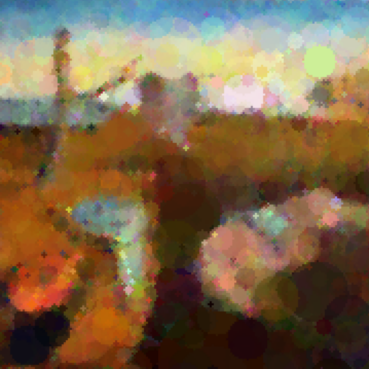

# Genetic Algorithm for Drawing

This repository presents a genetic algorithm designed to mimic a reference image using random circles of different colors, sizes, and opacities. The algorithm evolves a population of candidate solutions over several generations to closely match the reference image by optimizing a fitness function. 

## Table of Contents

- [Introduction](#introduction)
- [Genetic Algorithm Components](#genetic-algorithm-components)
- [Configuration](#configuration)
- [Main Functions](#main-functions)
  - [Initialization](#initialization)
  - [Fitness Evaluation](#fitness-evaluation)
  - [Crossover and Mutation](#crossover-and-mutation)
  - [Selection](#selection)
- [Algorithm Steps](#algorithm-steps)
- [Results](#results)
- [Installation](#installation)
- [Usage](#usage)
- [Contributors](#contributors)
- [License](#license)

## Introduction

A genetic algorithm (GA) is a search heuristic inspired by the process of natural selection. It is commonly used to find approximate solutions to optimization and search problems. This project utilizes a GA to approximate a reference image using randomly generated circles. The main steps in a genetic algorithm are:
1. Initialization: Start with a randomly generated population of individuals.
2. Evaluation: Assess the fitness of each individual in the population.
3. Selection: Select individuals based on their fitness to become parents for the next generation.
4. Crossover: Combine pairs of parents to produce offspring, introducing genetic diversity.
5. Mutation: Apply random changes to offspring to maintain genetic diversity.
6. Replacement: Form a new population by replacing some or all of the old population with the new offspring.
7. Termination: Repeat steps 2-6 until a stopping criterion is met (e.g., a maximum number of generations or a satisfactory fitness level).

## Genetic Algorithm Components

- **Chromosome**: A single solution represented by a list of circles. Each circle is defined by its position (x, y), radius, color (R, G, B), and opacity (alpha).
- **Gene**: A single circle within a chromosome.
- **Population**: A collection of chromosomes (solutions).
- **Fitness Function**: Measures how closely a chromosome matches the reference image, with lower values indicating a better match.
- **Selection**: Uses tournament selection to choose the best chromosomes for reproduction.
- **Crossover**: Swaps genes between pairs of chromosomes to create new offspring.
- **Mutation**: Randomly alters genes within chromosomes to introduce new variations.

## Configuration

The algorithm is configured through several parameters:
- `img_width` and `img_height`: Dimensions of the images to be processed.
- `max_circle_radius`: Maximum radius of the circles.
- `num_genes`: Number of circles in each chromosome.
- `tm_size`: Tournament size for selection.
- `mutation_type`: Mutation strategy (guided or unguided).
- `mutation_prob`: Probability of mutation.
- `num_generation`: Maximum number of generations.
- `num_inds`: Number of individuals in the population.
- `frac_elites` and `frac_parents`: Fractions of elites and parents in the population.
- `early_stop`: Whether to stop early if a certain fitness level is reached.
- `show_img`: Whether to display intermediate images.
- `save_image_per_generation`: Determines how often to save images during evolution.

## Main Functions

### Initialization

- `init_population(num_inds, num_genes)`: Initializes the population with random chromosomes. Each chromosome is a list of circles with random attributes (position, radius, color, opacity).

### Fitness Evaluation

- `evaluate_fitness(pop, num_inds, num_genes, background, generation)`: Evaluates the fitness of the population by drawing the circles on a canvas and comparing the result to the reference image using a sum of squared differences.

### Crossover and Mutation

- `crossover(parents)`: Combines pairs of parent chromosomes to create offspring, introducing genetic diversity.
- `mutation(parents_after_crossover)`: Applies mutations to the parents. If the mutation is guided, the changes are made relative to the current gene values.

### Selection

- `tournament_selection(population)`: Selects parents using tournament selection, preserving a certain number of elites.

## Algorithm Steps

1. Initialize population:
   - The population is initialized with random chromosomes.

2. Evaluate initial fitness:
   - The initial fitness of the population is evaluated.

3. Genetic Algorithm Loop:
   - If `early_stop` is enabled, the loop continues until a satisfactory fitness level is reached.
   - Otherwise, the loop runs for a specified number of generations.
   - In each generation:
     - Selection: Selects parents and elites.
     - Crossover: Creates offspring from parents.
     - Mutation: Applies mutations to the offspring.
     - Create new population: Combines elites and mutated offspring.
     - Evaluate fitness: Evaluates the fitness of the new population.
     - Output fitness: Outputs the current fitness and generation number.

4. Plot Generated Image:
   - After each N iterations, the generated image is plotted and saved. The fitness values across generations are plotted and saved as well.


## Results

Below are the reference image and an example generated image:

### Reference Image


### Generated Image


## Installation

### Prerequisites

- Python 3.8 or higher
- pip (Python package installer)

### Setting Up a Virtual Environment

```bash
python -m venv env
source env/bin/activate  # On Windows use `env\Scripts\activate`
```

### Installing Dependencies

```
git clone https://github.com/ardaxz99/Genetic-Algorithm-Drawing.git
cd Genetic-Algorithm-Drawing
pip install -r requirements.txt
```

## Usage

Execute the main script to reproduce the results:

```
python main.ipynb
```

## Contributors

- **Arda Baris Basaran**

## License

This project is licensed under the MIT License - see the LICENSE.md file for details.
